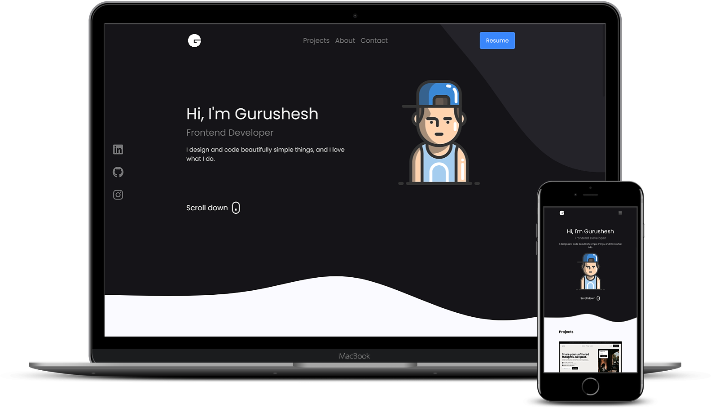

**Portfolio**
Live Preview - [Click Here](https://gurusheshp.vercel.app/)

 

  

 
 

# 🛠 Installation and Setup Instructions

Clone down this repository. You will need node.js and git installed globally on your machine..

Installation: `npm install`

In the project directory, you can run: `npm start`

Runs the app in the development mode.\
Open [http://localhost:3000](http://localhost:3000) to view it in the browser.

# Usage Instructions

Open the project folder and Navigate to `/src/data/ProjectData` and add your projects details.

You will find all the components used and you can edit your information accordingly.

## Contribute

Pull Requests are welcome. :)

## Show your support

Give a ⭐ if you like this website!
